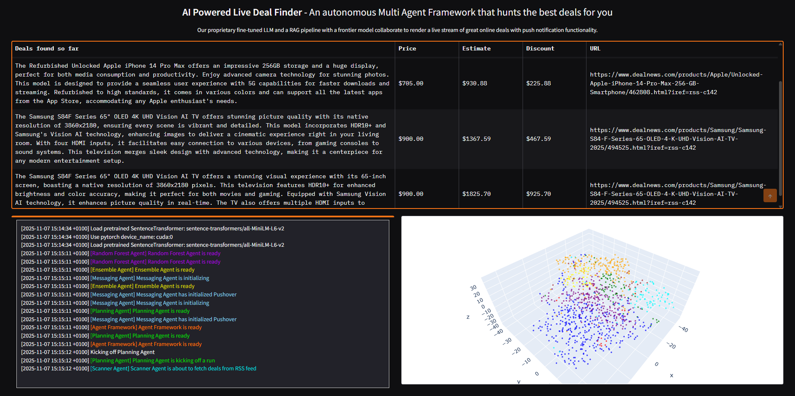

# AI-Powered Multi-Agent Deal Finder

## Overview
This application automates deal discovery on e-commerce marketplaces by orchestrating a team of specialised agents. Each agent focuses on a specific task—from scanning RSS feeds and extracting product details, to predicting fair prices and notifying end users—so the system can surface opportunities in real time. The project centres on a fine-tuned Llama 3.1 8B model that estimates prices from product descriptions, and combines its predictions with additional models in an ensemble for improved accuracy.

## Goals
- Continuously ingest marketplace deals and extract structured information.
- Predict fair prices using complementary modelling approaches (LLM, RAG, classical ML).
- Identify the best opportunities based on estimated discounts and push timely notifications.
- Present a live dashboard that highlights current deals, model logs, and vector database visualisations.

## System Architecture
The application is built around coordinated agents and supporting services:
- **Scanning Agent**: Polls deal RSS feeds, extracts prices, and refines descriptions through GPT-4o-mini.
- **Frontier Agent**: Uses a GPT-4o-mini model augmented with a 400k-sample RAG datastore for price estimation.
- **Random Forest Agent**: Predicts prices with a random forest regressor trained on the curated Amazon dataset.
- **Specialist Agent**: Queries the fine-tuned Llama 3.1 8B model hosted on Modal.
- **Ensemble Agent**: Blends predictions from the RAG model, random forest, and Llama via linear regression.
- **Messaging Agent**: Delivers push notifications via Pushover when opportunities exceed the target threshold.
- **Planning Agent**: Orchestrates agent execution and compiles a ranked list of deals with estimated discounts.

Supporting components include:
- **Chroma Vector Store**: Stores embedded training samples for RAG retrieval.
- **Modal Deployment**: Hosts the fine-tuned Llama service (`pricer_service2`).
- **Gradio UI**: Provides a live feed of deals, real-time logs, and a 3D vector-store visualisation.

## Data Preparation
The models use a curated subset of the Amazon marketplace dataset (`imonghose/pricer-data`). The dataset is stored locally as `train.pkl` and `test.pkl` via:
```python
from datasets import load_dataset
import pickle

dataset = load_dataset("imonghose/pricer-data")
train = dataset["train"]
test = dataset["test"]

with open("train.pkl", "wb") as file:
    pickle.dump(train, file)

with open("test.pkl", "wb") as file:
    pickle.dump(test, file)
```

## Repository Layout
Key resources for experimentation and deployment:
- `01_modal_setup.ipynb`: Deploys the fine-tuned Llama model (`imonghose/product-pricer-llama-2025-10-19_09.16.39`) to Modal.
- `02_rag_setup.ipynb`: Builds the Chroma vector datastore for RAG queries.
- `03_2D_viz.ipynb` & `04_3D_viz.ipynb`: Generate t-SNE visualisations of the vector space.
- `05_gpt_4o_mini_rag.ipynb`: Evaluates the RAG-enhanced GPT-4o-mini model.
- `06_ensemble_model.ipynb`: Trains and analyses the ensemble regressor.
- `07_scanning_agent.ipynb`: Validates the scanning pipeline across deal sources.
- `08_messaging_planning_agents.ipynb`: Exercises the messaging and planning agent logic.
- `agents/`: Individual agent implementations (frontier, specialist, random forest, ensemble, messaging, scanner, planner).
- `deal_agent_framework.py`: Initialises agents, shared memory, and executes planning routines.
- `price_is_right_final.py`: Application entry point that launches the Gradio experience.
- `App-Screenshot.png`: Snapshot of the live dashboard.

## Setup & Usage
1. **Environment**
   - Install Python 3.10+ and set up a virtual environment.
   - Install project dependencies (example: `pip install -r requirements.txt` if available).
2. **Modal Deployment**
   - Configure Modal CLI credentials.
   - Deploy the fine-tuned Llama service: `modal deploy -m pricer_service2`.
3. **Run the Application**
   - Start the UI: `python price_is_right_final.py`.
   - Open the provided local URL to view live deals, logs, and visualisations (auto-refresh every 5 minutes).

## Process Highlights
1. **Data Curation**: `imonghose/pricer-data` supplies product descriptions and prices, transformed into train/test pickles for fast access.
2. **Model Training**: Random forest, RAG GPT-4o-mini, and fine-tuned Llama models are trained and benchmarked individually.
3. **Ensemble Learning**: A linear regression ensemble integrates predictions to improve price estimation accuracy.
4. **Agent Coordination**: The planning agent sequences scanning, scoring, thresholding, and notification tasks.
5. **User Interface**: A Gradio dashboard displays live opportunities alongside operational telemetry.

## Outcomes
- The ensemble model delivers better price predictions than any single component model, leading to more reliable deal assessments.
- The system publishes a continuous stream of marketplace opportunities with estimated discounts and optional push alerts.
- The modular, multi-agent architecture can be adapted to any new data sources or analytical models for marketplace research.

## Artifacts & Visuals
- **Dashboard Preview**: 
- **Notebooks**: Each notebook documents experimentation and validation for its respective subsystem.

## Future Work
- Expand data ingestion beyond RSS feeds (direct APIs, web scraping, or user-submitted deals).
- Incorporate reinforcement learning for dynamic threshold tuning and notification policies.
- Add automated evaluation pipelines and monitoring for production deployments.
- Extend the ensemble with additional specialist models (e.g., gradient boosting, larger LLMs).

## License
This repository is provided for research and educational purposes. Review third-party datasets and APIs for their respective usage terms before deployment.
